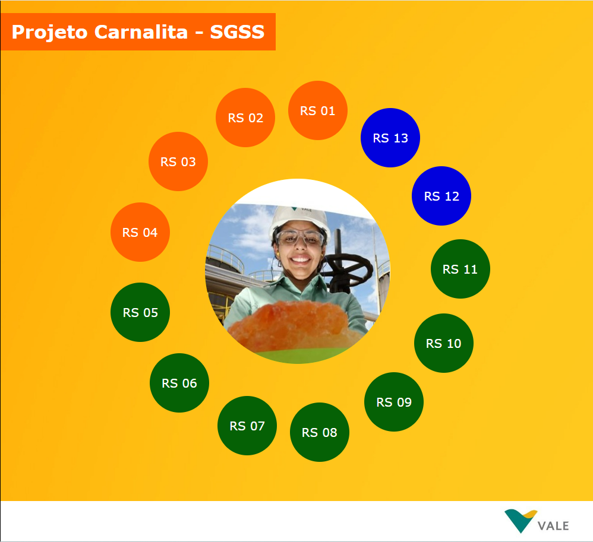
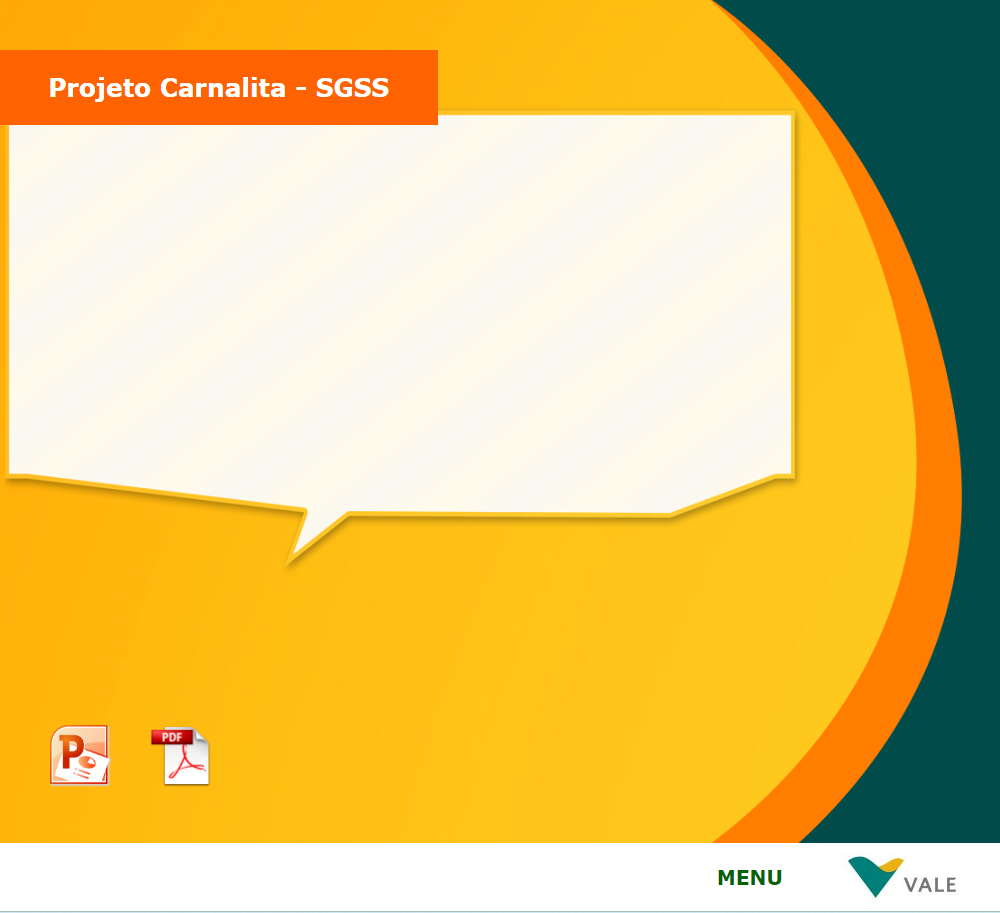

## Projeto Carnalita: Uma Transição de Adobe Flash para Javascript

Em 2011, fui desafiado a desenvolver um projeto inovador para a Vale do Rio Doce, denominado "Projeto Carnalita". O objetivo era criar uma apostila eletrônica interativa para facilitar o aprendizado e a compreensão de processos específicos na indústria de mineração. Naquela época, optei por utilizar a tecnologia Adobe Flash com ActionScript 3.0 para desenvolver uma experiência rica e dinâmica.

O Adobe Flash oferecia uma plataforma robusta naquela época, permitindo a criação de animações, interatividade e uma experiência envolvente para os usuários. No entanto, com as mudanças na tecnologia e a descontinuação do suporte ao Flash, tornou-se imperativo migrar para soluções mais modernas e acessíveis.

Ao longo dos anos, a indústria de desenvolvimento web evoluiu consideravelmente, e o Javascript emergiu como a linguagem de escolha para interações dinâmicas no navegador. Com isso em mente, decidi revisitar o Projeto Carnalita e redesenhar a apostila eletrônica usando Javascript.

A nova versão do projeto mantém o espírito inovador, mas agora se beneficia das capacidades avançadas oferecidas pelo Javascript. Utilizando as bibliotecas modernas, fui capaz de reproduzir as funcionalidades existentes na versão original do Flash, adaptando-as para a web contemporânea.

Agora, os usuários podem acessar o conteúdo do Projeto Carnalita de forma fácil e eficiente em qualquer dispositivo, sem a necessidade de plugins específicos. A transição para Javascript também proporcionou uma melhoria na acessibilidade, garantindo que o conhecimento contido na apostila eletrônica seja amplamente acessível.

Além disso, a atualização para Javascript permitiu a integração de elementos mais interativos, como gráficos dinâmicos e animações suaves, enriquecendo ainda mais a experiência do usuário. A nova versão do Projeto Carnalita não apenas preserva o valor educacional original, mas também o aprimora para atender aos padrões contemporâneos de desenvolvimento web.

Essa jornada de transição do Adobe Flash para Javascript no Projeto Carnalita reflete não apenas uma adaptação tecnológica, mas também um compromisso contínuo com a inovação e a entrega de conteúdo educacional de alta qualidade. Estou confiante de que essa evolução contribuirá significativamente para a disseminação efetiva do conhecimento na indústria de mineração, consolidando o Projeto Carnalita como uma referência duradoura.

